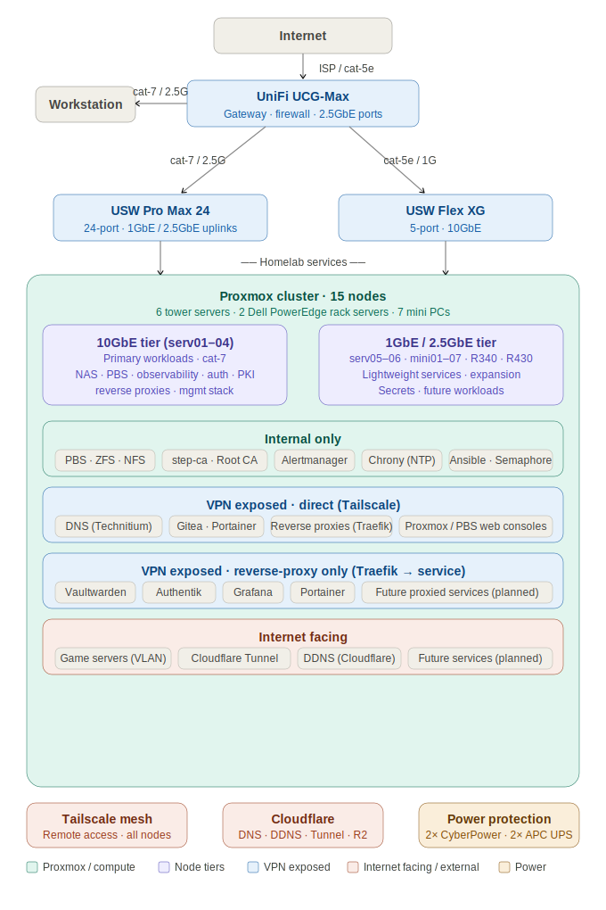

# proxmox-homelab

A production-grade private cloud built from the ground up as a learning environment and personal infrastructure platform. What started as a few old desktop PCs in early 2025 has grown into a 15-node Proxmox cluster running enterprise-pattern security, networking, and DevOps tooling.

---

## Architecture Overview

**Compute:** 2 Dell PowerEdge rack servers (R340 and R430), 6 tower servers (serv01–06), and 7 mini PCs (mini01–07), all running Proxmox VE for a total of 15 nodes. Workloads are distributed across dedicated VMs and LXC containers depending on resource requirements.

**Networking:** VLAN-segmented flat network with a management VLAN (10.0.0.0/24) and planned expansion into internal services, internet-exposed, and IoT/WiFi tiers. All inter-VLAN routing is controlled by firewall policy.

**Security posture:** Default-deny inbound and outbound on all hosts, enforced by Proxmox firewall using Security Groups and IPSets. Direct web GUI access restricted to Traefik IPs and specific management machines. Break-glass local accounts exist per service with complex passwords stored separately in Vaultwarden; all other local accounts disabled.

---

## Core Services

| Service | Host | Role |
|---|---|---|
| Technitium DNS | dns-a + 2 redundant LXCs | Internal authoritative DNS, split-horizon resolution |
| Traefik | rp-01, rp-02 | Redundant reverse proxies, wildcard TLS termination |
| Authentik | auth-01 | SSO and MFA enforcement across all web services |
| Gitea | mgmt-01 | Local Git hosting, mirrored to GitHub for offsite backup |
| Portainer | mgmt-01 (+ agents on all hosts) | Centralized Docker management |
| Ansible + Semaphore | mgmt-01 | Cluster-wide automation and scheduled health checks |
| Prometheus + Grafana + Loki | obs-01 | Metrics, dashboards, log aggregation |
| Alertmanager | obs-01 | Alert routing and email notifications |
| Proxmox Backup Server | pbs-serv02, pbs-serv03 | Redundant VM/LXC backup chain |
| Vaultwarden | vault-01 | Secrets and password management |
| step-ca + Offline Root CA | Internal PKI | Certificate issuance for services requiring direct TLS |

---

## Design Philosophy

Several core principles guided the architecture of this lab as I built it from the ground up. Many of these were identified in my original homelab builtout that ended up being completely wiped. Most of the other goals came from the desire to challenge myself and understand systems design on a deeper level.

**Security and least-privilege access** were the primary drivers. The Proxmox firewall enforces default-deny on both inbound and outbound traffic at the hypervisor level, meaning nothing communicates unless explicitly permitted. Service accounts are scoped to the minimum necessary access to reduce blast radius. For example, Portainer's Gitea tokens are read-only, unable to push or modify repository contents. Web GUIs are restricted to Traefik IPs and specific management machines; the broader LAN subnet has no access to them. Secrets moved from plaintext files to Vaultwarden early on. SSO and MFA are enforced across all management interfaces via Authentik. Internet exposure is minimized by design; most services are internal-only or accessible only over Tailscale, with a Cloudflare Tunnel handling the small subset that needs public reachability. Each layer is intended to limit the blast radius of any single compromised component.

**Maintainability and consistency** shaped the operational model. A previous lab iteration accumulated patchwork solutions, inconsistent conventions, and tightly coupled configurations; changes reliably broke unrelated things, to the point where I actively avoided making any changes to my lab. This lab was designed to avoid that, and while my previous homelab had many issues, those same issues taught me what to focus on and how to avoid those pitfalls in this iteration. Infrastructure changes flow through Git: each complex stack has a dedicated Gitea repository, Docker Compose files follow a consistent layout, and Portainer deploys from those repositories via GitOps workflows rather than ad-hoc changes. Naming conventions, VM roles, and container configurations are standardized across hosts. Purpose-built VMs handle specific domains (mgmt-01, obs-01, auth-01, etc.) rather than co-locating unrelated services. Ansible and Semaphore handle cluster-wide automation and scheduled health checks. The goal is an environment where making a change is straightforward and its scope is predictable.

**Redundancy and disaster recovery** were informed by real data loss from the previous lab. The current design targets the ability to survive any single failure, whether that be a disk, a host, a power event, or a security incident, without permanent data loss or extended downtime. DNS runs across three nodes. Reverse proxies are deployed in a redundant pair with automatic failover. Proxmox Backup Server runs a two-node chain with offsite sync to Cloudflare R2, ensuring a clean copy survives even a local ransomware event. ZFS provides storage-level redundancy on the NAS. UPS units cover all hardware against power loss. For services not yet redundant, break-glass recovery procedures are documented and tested. Expanding redundancy to the observability, auth, and secrets stacks is an active near-term priority.

**Observability** ties the whole environment together. Prometheus scrapes metrics from all hosts via node, cAdvisor, PVE, PBS, and blackbox exporters. Grafana provides dashboards. Loki aggregates logs via Alloy. Alertmanager handles routing and email notifications. Weekly iPerf3 tests baseline network throughput between hosts to catch degradation before it becomes a problem. The intent is that failures surface through alerts and dashboards rather than being discovered when something stops working.

---

## Key Design Patterns

**GitOps deployments** — Complex stacks (reverse proxies, observability, auth, management) each have a dedicated Gitea repository. Docker Compose files live in a `/compose` subdirectory. Each repository has a dedicated Gitea service account scoped to that repo only, following least-privilege principles; no single credential grants access across stacks. Portainer uses read-only access tokens tied to these service accounts, meaning it can pull Compose files but cannot push or modify repository contents. All infrastructure changes go through Git.

**Zero-trust firewall** — Proxmox firewall enforces default-deny at the hypervisor level for both inbound and outbound traffic. Services communicate only on explicitly permitted ports to permitted sources, using IPSets for source groups and Security Groups for reusable rule sets.

**Automated health checking** — Semaphore runs a weekly "Baseline Health Check" playbook targeting every host. It verifies reachability, checks disk usage, validates ZFS pool health (on Proxmox nodes), checks DNS resolution, and verifies Chrony sync status. Results are consolidated into an email report.

**Layered backup chain** — `pbs-serv02` runs backup, verify, and prune jobs against all VMs and containers. `pbs-serv03` runs sync jobs from `pbs-serv02` approximately 2 hours later. A weekly rsync job replicates a backup of the PBS datastore to a Cloudflare R2 bucket for offsite cold storage.

**Observability stack** — Prometheus scrapes metrics from cAdvisor, node_exporter, pve_exporter, pbs_exporter, and blackbox_exporter across all hosts. Grafana provides dashboards, Alloy ships logs to Loki, and weekly iPerf3 tests run between hosts to baseline network throughput and catch degradation early.

---

## Storage

All shared storage is served by `serv01`, which runs two independent ZFS volumes and acts as both an NFS and SMB server for the cluster.

**HDD volume — RAIDZ mirror (4 drives, ~30TB usable):** Primary long-term storage. Provides redundancy and high capacity. Used for large data archives, VM storage, ISO libraries, and anything where durability matters more than throughput.

**NVMe volume — RAIDZ0 (single NVMe, ~4TB):** High-I/O scratch and transfer tier. No redundancy by design, used for fast temporary transfers and workloads where speed is the priority and the data is either ephemeral or lives elsewhere durably.

Each volume has ZFS datasets created on it for dedicated purposes (SMB storage and NFS storage), making storage space dynamically allocated within each volume. This means that datasets grow as needed until all storage is used rather than being statically partitioned. This also means that the full capacity of each pool is available to whichever dataset needs it at any given time.

Both NFS and SMB (Samba) are served from a dataset on each pool, making storage available to Proxmox nodes and VMs via NFS mounts, and to Windows devices on the network via Samba shares. This also allows the NFS and SMB shares to use the same underlying ZFS infrastructure.

---

## Domains & TLS

- **reladox.net** — owned, managed via Cloudflare
- **\*.lab.reladox.net** — internal service FQDNs, resolved by Technitium
- **\*.web.reladox.net** — web GUI access via Traefik on rp-01/rp-02, wildcard TLS cert
- **\*.reladox.net** — Proxmox hosts (legacy naming); Technitium CNAME records bridge lab FQDNs to these hostnames

TLS is terminated at Traefik for all proxied services. Backend services communicate over HTTP internally. Services requiring direct TLS (bypassing Traefik) use certificates issued by step-ca.

---

## Internet-Exposed Services

A dedicated internet-exposed VLAN hosts game servers accessible to friends and family. Exposure is managed through Cloudflare Dynamic DNS (running in a Debian 13 container), Cloudflare DNS records, and a Cloudflare Tunnel for applicable services — minimizing direct port exposure where possible.

---

## Remote Access

Tailscale is deployed on all primary servers, providing secure remote access without exposing management interfaces to the public internet.

---

## Tech Stack Summary

**Hypervisor:** Proxmox VE  
**Containers/VMs:** LXC (Debian), VMs (Ubuntu Server LTS, Debian 13, Windows 11)  
**Networking:** Technitium DNS, Traefik, Cloudflare, Tailscale, VLAN segmentation  
**Security:** Proxmox firewall (IPSets/Security Groups), Authentik, step-ca, Vaultwarden  
**DevOps:** Gitea, GitHub, Portainer, Ansible, Semaphore, Docker Compose  
**Observability:** Prometheus, Grafana, Loki, Alertmanager, Alloy, cAdvisor, multiple exporters  
**Storage:** ZFS (RAIDZ mirror HDD + RAIDZ0 NVMe), NFS, Samba, Cloudflare R2 (offsite), Proxmox Backup Server  
**Scripting:** Python, Bash

---

## Current State

| Area | Status | Notes |
|---|---|---|
| Proxmox cluster | ✅ Live | 15 nodes, all healthy |
| Networking | ✅ Live | UCG-Max, USW Pro Max 24, USW Flex XG |
| DNS | ✅ Live · redundant | 3-node Technitium cluster |
| Reverse proxy | ✅ Live · redundant | rp-01 + rp-02, Traefik, 60s TTL failover |
| Authentik (SSO/MFA) | ✅ Live · single node | Redundancy planned |
| Gitea + Portainer + Ansible | ✅ Live · single node | mgmt-01 redundancy planned (lower priority) |
| Proxmox Backup Server | ✅ Live · redundant | pbs-serv02 + pbs-serv03 chain, R2 offsite sync |
| Observability stack | ✅ Live · single node | obs-01 redundancy planned |
| Vaultwarden | ✅ Live · single node | Redundancy planned |
| Internal PKI | ✅ Live | Offline root CA + step-ca |
| VLAN segmentation | 🔄 In progress | Management and internet-exposed VLANS live; internal services, IoT, and Wi-Fi VLANs planned |
| UPS shutdown automation | 🔄 In progress | Hardware in place, automation not yet configured |
| RustDesk server | 📋 Planned | Self-hosted remote desktop relay |
| Lab wiki / documentation platform | 📋 Planned | Centralized internal docs |
| Security monitoring (SIEM/IDPS) | 📋 Planned | Log aggregation, alerting, host-based intrusion detection |
| Vulnerability scanning | 📋 Planned | Scheduled scanning + dedicated pentest VM |
